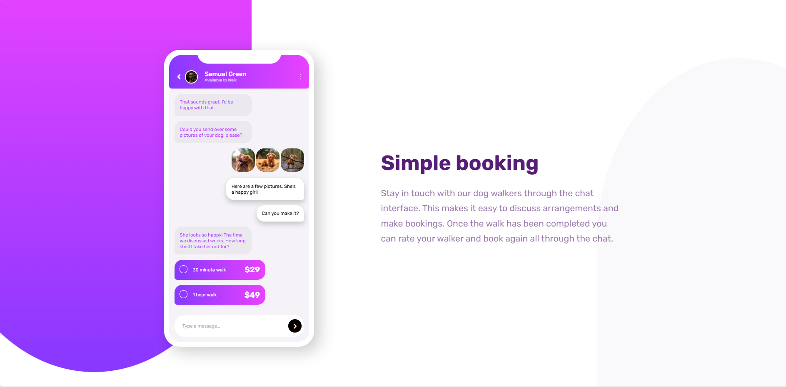
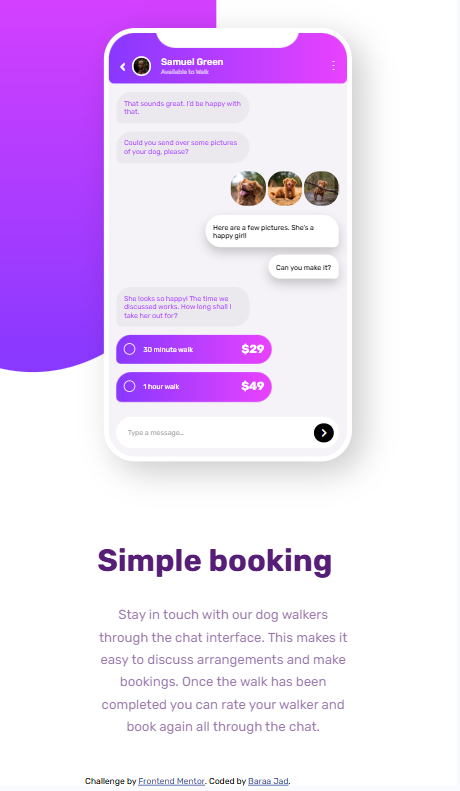

# Chat App CSS Illustration – Frontend Mentor

A responsive chat UI illustration built with **HTML & CSS only**, based on the Frontend Mentor challenge.

---

## 📸 Screenshots

**Desktop Preview**



**Mobile Preview**


---

## 🔗 Live Demo & Repo

* **Live Site URL:** [https://baraajad231.github.io/chat-app-css-illustration-master/](https://baraajad231.github.io/chat-app-css-illustration-master/)
* **Repository:** [https://github.com/Baraajad231/chat-app-css-illustration](https://github.com/Baraajad231/chat-app-css-illustration)

---

## 🎯 The Challenge

Users should be able to:

* View the optimal layout for the component depending on their device's screen size.
* **Bonus:** See the chat interface animate on initial load.

---

## 🧩 Built With

* Semantic **HTML5** markup
* **CSS** (Flexbox & CSS Grid)
* **HSL** colors & CSS variables
* **Mobile-first** workflow
* Small **CSS animations** 

---

## 🗂️ Folder Structure

```text
root
├─ images/                # assets from the challenge
├─ design/                # provided JPG designs
├─ Result/                # provided png for what we got
├─ index.html
├─ styles.css
└─ README.md
```

---

## 🛠️ How to Run Locally

```bash
# 1) Clone
git clone https://github.com/your-username/chat-app-css-illustration.git
cd chat-app-css-illustration

# 2) Open in browser
# Just open index.html (no build needed)
```

**Optional (Live Server):**

* VS Code → Extensions → Live Server → Right-click `index.html` → *Open with Live Server*

---

## 🧱 Implementation Notes

### Layout

* Wrapper uses CSS Grid to split **mobile mockup** and **description** columns on desktop.
* On mobile, it stacks into a single column using media queries.

### Styling Highlights

* Gradient header and background blobs using `linear-gradient`.
* Shadows and large rounded corners for the mobile shell.
* Chat bubbles with asymmetric `border-radius`.

### Responsiveness

* Breakpoints used: `1200px`, `1100px`, `900px`, `400px`.
* Uses `rem` for scalable typography and spacing; \*\*fixed \*\***`px`** for borders/radius where a stable size is needed.

### Accessibility

* Sufficient color contrast checked for text over gradients.
* Focus styles for keyboard navigation (add if not present).
* Meaningful alt text for images (person avatar, dog photos).

### Performance

* Assets are optimized (from challenge).
* No external JS frameworks.

---

## ✨ Bonus Animation 

Add a simple load-in animation for the chat area:

```css
@keyframes fadeUp {
  from { opacity: 0; transform: translateY(8px); }
  to   { opacity: 1; transform: translateY(0); }
}

.mobile_main { animation: fadeUp .6s ease-out both; }
```

---

## 📏 Style Guide

* **Font:** Rubik (Google Fonts)
* **Primary Colors:**

  * `--pink: hsl(293, 100%, 63%)`
  * `--purple: hsl(264, 100%, 61%)`
  * `--surface: hsl(270, 20%, 96%)`
* **Typography Scale (example):**

  * Base: `16px` (1rem)
  * h1: `2.5rem`
  * small text: `0.75rem`

---

## 🧠 What I Learned

* How to build a clean component with **only HTML & CSS**.
* When to use **`rem`** vs **`px`** (e.g., fixed borders/radius in `px` to avoid scaling).
* Combining **Grid + Flexbox** for complex but simple-to-maintain layouts.

---

## 🚧 Challenges

* Matching the gradient shapes from the design.
* Keeping the chat bubbles consistent across screen sizes.

---

## 🔮 Future Improvements

* Add a11y improvements (tab order, focus rings).
* Prefers-reduced-motion support for users who disable animations.
* Dark mode variant.

---

## 🧑‍💻 Author

* Frontend Mentor – [@Baraajad231](https://www.frontendmentor.io/profile/Baraajad231)

---


